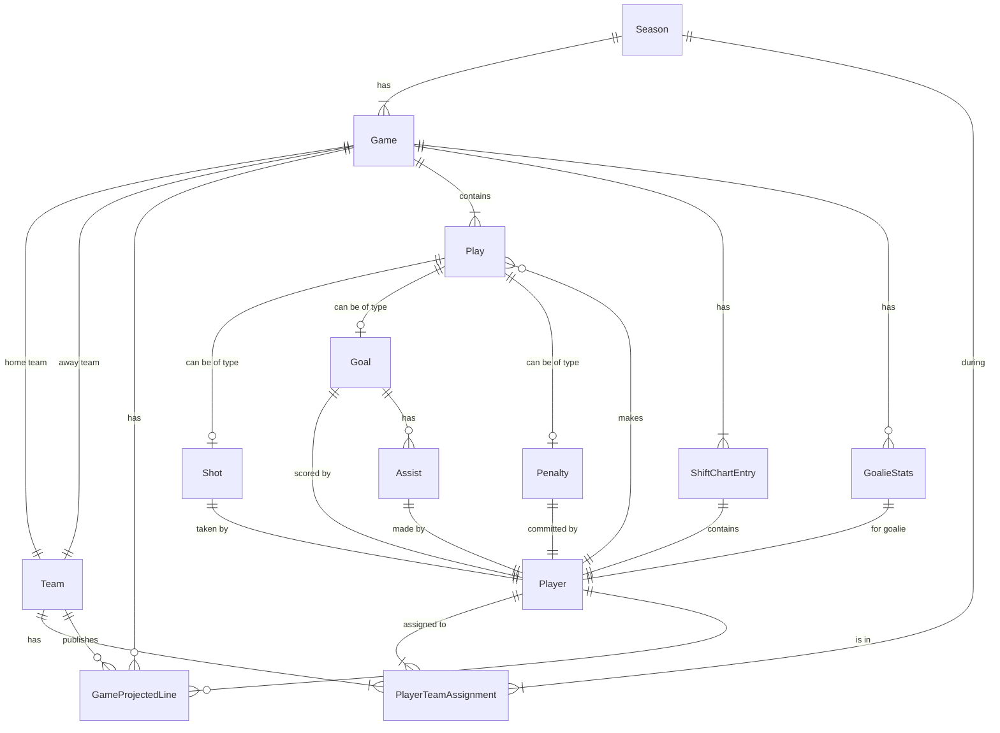

<!--
erDiagram key

Taken from: https://mermaid.js.org/syntax/entityRelationshipDiagram.html#relationship-syntax

Value (L)  Value (R)  Meaning
|o         o|         Zero or one
||         ||         Exactly one
}o         o{         Zero or more (no upper limit)
}|         |{         One or more (no upper limit)
-->

